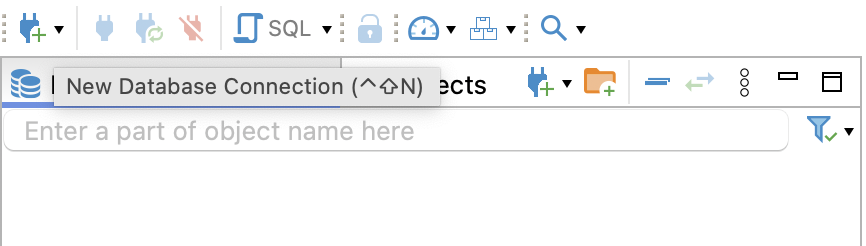
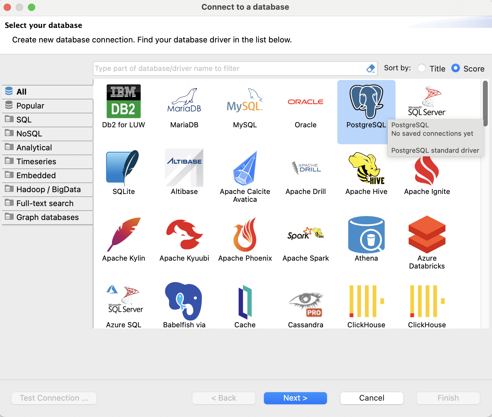
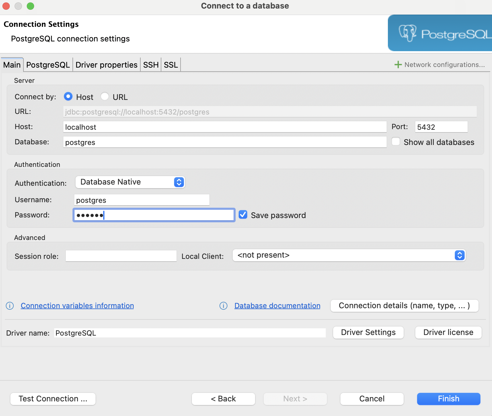
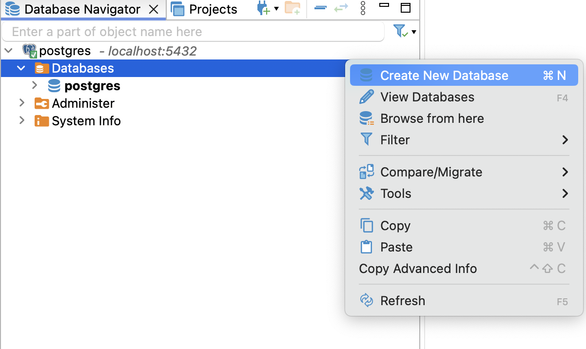
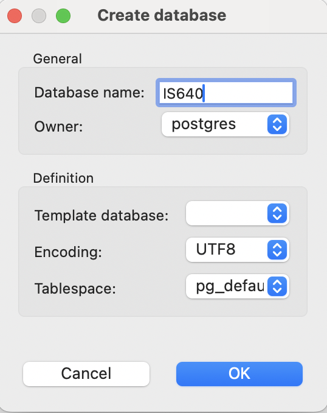
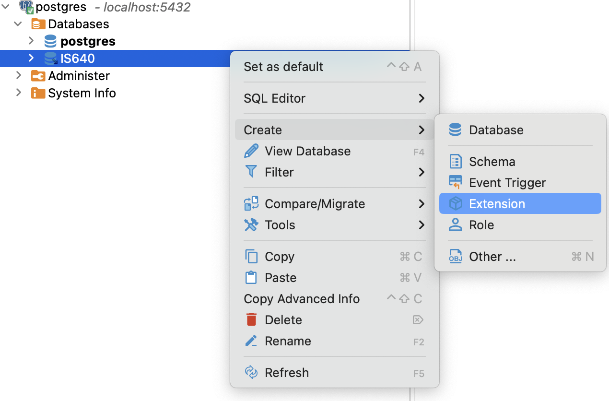
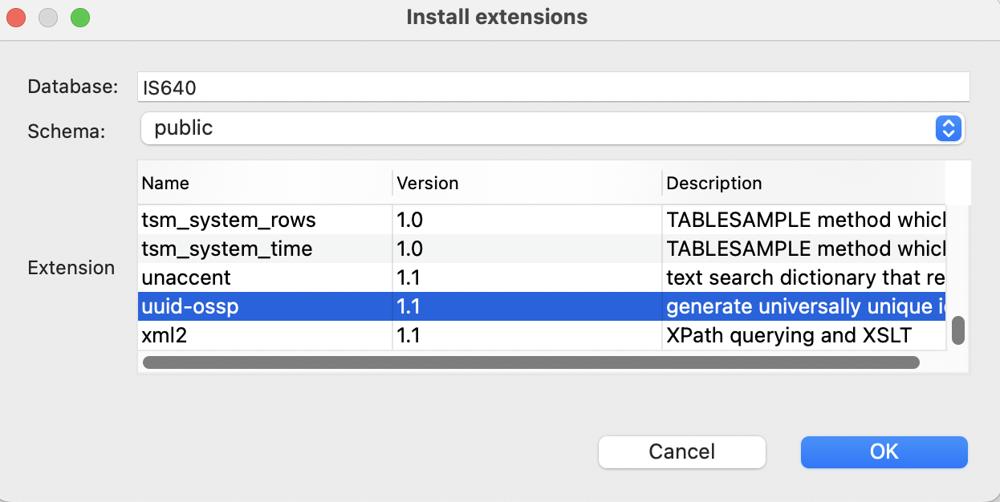

# ISEC640 Final Project: Password Update Web Application

This project is a simple web form GUI written in React to change a user's password, integrated with a PostgreSQL database inside a Docker container through a TypeScript Restful API, complete with error handling middleware, password hashing, and security measures against DoS and SQL Injection attacks.

While a docker-compose file is included in this project for quick container setup, it is not working as intended, and shall be updated at a later date. To keep up with updates, visit `https://github.com/JVpv/IS640-FinalProject`.

---

## Features

1. **User-Friendly Web GUI**

   - **Technology**: Implemented using React.js
   - **Functionality**: Provides an intuitive interface for users to easily change their passwords.

2. **Secure Password Management**

   - **Hashing Algorithm**: Utilizes SHA-256 hashing in the application layer
   - **Security**: Ensures passwords are securely hashed before storage and during transport, protecting user credentials from potential breaches.

3. **Enhanced Performance with Caching**

   - **Caching Mechanism**: Implemented using Redis
   - **Performance**: Reduces database load and improves response times by caching frequently accessed data.

4. **Protection Against SQL Injection Attacks**

   - **ORM**: Utilizes TypeORM
   - **Security**: Prevents SQL injection attacks by using parameterized queries and ORM features.

5. **DoS Attack Mitigation**

   - **Rate Limiting**: Implemented using rate-limiter
   - **Security**: Protects the application from Denial-of-Service (DoS) attacks by limiting the number of requests a user can make in a specified time period.

6. **Clean Code Architecture**

   - **Principles**: Follows Dependency Injection and SOLID principles
   - **Maintainability**: Ensures the codebase is clean, modular, and easy to maintain or extend.

7. **Containerized Application Deployment**
   - **Technology**: Utilizes Docker for containerization
   - **Benefits**: Facilitates easier deployment, scalability, and management of the application in a distributed system environment.

---

## Prerequisites

Before you begin, ensure you have the following installed on your system:

- Docker
- Node.js
- A database manager capable of connecting to Postgresql (DBeaver in specific was the one chosen for this application)
- An API client for sending requests (such as Insomnia and Postman)
- npm (Node Package Manager)
- Yarn (optional)

---

## Getting Started

To run this project, follow these steps:

### Step 1: Navigate to the project folder

Open two terminal windows inside the project folder. One window will be used for running the Web Application, while the other one will run the backend API.

### Step 2: Docker

As the docker-compose file is not working currently, the container setup will be done manually. Thus, the following commands should be executed:

```
docker run --name postgres -e POSTGRES_PASSWORD=docker -p 5432:5432 -d postgres
```

This first command will create the database.

```
docker run --name redis -p 6379:6379 -d -t redis:alpine
```

This second command creates an instance of redis, which will be used for cache, and thus increasing the application's performance. It is also necessary for the application, as one of the core features implemented (rate-limiter) requires redis to be running and connected.

```
docker run --name redis-client -v redisinsight:/db -p 8001:8001 -d -t redislabs/redisinsight:latest
```

Lastly, this command is the least necessary. It runs an instance of redisinsight, which is a GUI for redis, allowing the host to monitor the data stored in it.

### Step 3: Creating the database

For this step, any database manager can work, as long as they can make a connection to postgresql. I personally chose DBeaver for finding it simple to use, and thus, the instructions provided in this document will be explaining the step-by-step for this section using DBeaver, specifically, but other DBMSs should have similar means to complete the same tasks.



When first opening DBeaver, locate, on the top-left corner, the blue power plug icon with a green plus sign, to create a new database connection.



On the appearing window, select PostgreSQL, then click Next.



In this window, make sure the username is postgres, the host is localhost, and the port is 5432. Then, select the Password text field, and type 'docker' (without the quotes) as the password, and click Finish.



You will return to the start screen, but a connection to postgres should be estabilished. Then, expand it, and right click the Databases folder, then select Create New Database.



Type IS640 for Database name, and leave everything else as default. Then press OK.



Now, expand the Databases folder, right-click the now created IS640 database, and select Create -> Extension.



Now, scroll as far down as possible and select uuid-ossp. Then, click OK.

### Step 4: Migrating tables and starting the API

At this point, the most complicated steps are out of the way. Now, the database is created, but the tables are not. Fortunately, they can be created simply by running:

```
npm run migrate
```

or

```
yarn migrate
```

After the command is done, you may refresh the database at your DBMS to confirm the creation of the tables, if desired.

Now, to run the API, simply run:

```
npm run dev
```

or

```
yarn dev
```

The API will start running at `http://localhost:3333`.

### Step 5: Populating the database

Now, the API is running, but there is no data yet. A GUI for account creation was not developed (future updates after project delivery). However, any API client can simply send an HTTP request to the API to populate the database.
Open your client of choice, and send a POST request to `http://localhost:3333/users` with the following body (in JSON format):

```
{
	"name": "Joe",
	"email": "joe@example.com",
	"password": "7173da03a947cee530e3a66b5b8a1adb6952d709798d33c471039d8dcc20a45d"
}
```

Name is basically a decorative column, while e-mail is quite important, as it will be considered as the user's id by the GUI. Notice, however, that the password is already encrypted. This password is 'BB22@bbbbbbb' after being hashed in SHA-256, the algorithm used in the GUI for encrypting the passwords. The reason that the passwords are not encrypted directly into the API is to prevent the data from traveling unprotected.

Once sent, you should be receiving a response similar to this:

```
{
	"name": "Joe",
	"email": "joe@example.com",
	"password": "7173da03a947cee530e3a66b5b8a1adb6952d709798d33c471039d8dcc20a45d",
	"id": "632cb9a5-9d3e-4ba1-b224-b64bb5a8cb20"
}
```

But, of course, with a different ID.

Now, a second POST request should be sent, to create this user's password history. This time, the URL is `http://localhost:3333/passwords`. Use a body similar to this:

```
{
	"user_id":"632cb9a5-9d3e-4ba1-b224-b64bb5a8cb20",
	"current_password":"7173da03a947cee530e3a66b5b8a1adb6952d709798d33c471039d8dcc20a45d"
}
```

But replace user_id with the id received from the response on the previous request, where the user was created. You may input an incorrect ID, if desired, but as of now, this will result in a password history that will belong to no user on the database.

Or, you may try to create multiple password tables to the same user_id, but an error will be thrown, as there may only be one password table for each user.

On a successful request, a response similar to the one below will be shown:

```
{
	"current_password": "7173da03a947cee530e3a66b5b8a1adb6952d709798d33c471039d8dcc20a45d",
	"previous_password_1": "7173da03a947cee530e3a66b5b8a1adb6952d709798d33c471039d8dcc20a45d",
	"previous_password_2": "7173da03a947cee530e3a66b5b8a1adb6952d709798d33c471039d8dcc20a45d",
	"previous_password_3": "7173da03a947cee530e3a66b5b8a1adb6952d709798d33c471039d8dcc20a45d",
	"previous_password_4": "7173da03a947cee530e3a66b5b8a1adb6952d709798d33c471039d8dcc20a45d",
	"previous_password_5": "7173da03a947cee530e3a66b5b8a1adb6952d709798d33c471039d8dcc20a45d",
	"user_id": "632cb9a5-9d3e-4ba1-b224-b64bb5a8cb20",
	"id": "940e0f40-dac0-45a0-9dd3-64d9ade866c8"
}
```

The previous passwords are all the same when the table is first created, but they will be eventually overwritten.

### Step 6: Starting the web GUI

This is the final setup step. On your second terminal, simply run the following command:

```
npm start
```

After that, a window should open on your default browser, showing the web GUI. If the previous steps are done correctly, the containers are running, and the API is connected on port 3333, everything should be running smoothly.

---

### Question: how could an SQL injection attack happen on this code, and how was it prevented?

Traditionally, when input fields on a web form are used to accept parameters for SQL queries, they can be exploited by a malicious actor. If the application directly incorporates user input into SQL statements, an attacker with knowledge of SQL can manipulate the input to gain unauthorized access to data.

In this application, consider the form field for entering an User ID. A malicious actor could input a string like `%' OR 1=1 --`. This string manipulates the SQL query in such a way that it always returns true, effectively bypassing any intended constraints and potentially revealing all user records.

This type of attack is prevented in the application by using TypeORM, an Object-Relational Mapping (ORM) framework. TypeORM abstracts the database interactions and avoids the direct use of raw SQL statements. Instead, it uses parameterized queries and prepared statements.

When user input is passed to TypeORM, it treats the input values as parameters rather than part of the SQL syntax. This means that even if an attacker tries to inject malicious SQL code, it will be treated as a simple string input rather than executable SQL. Consequently, an input like `%' OR 1=1 --` would be considered invalid and would not compromise the security of the database.
